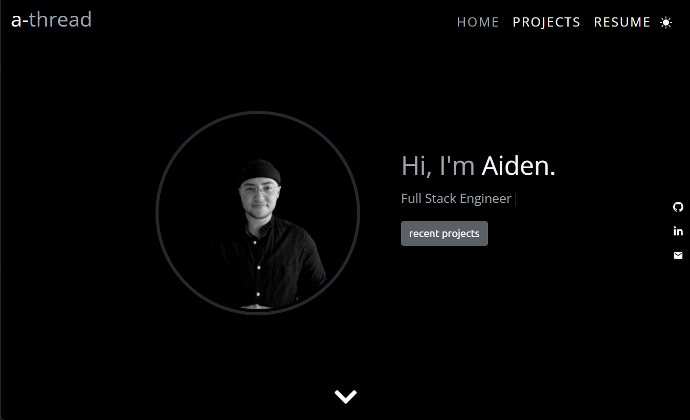
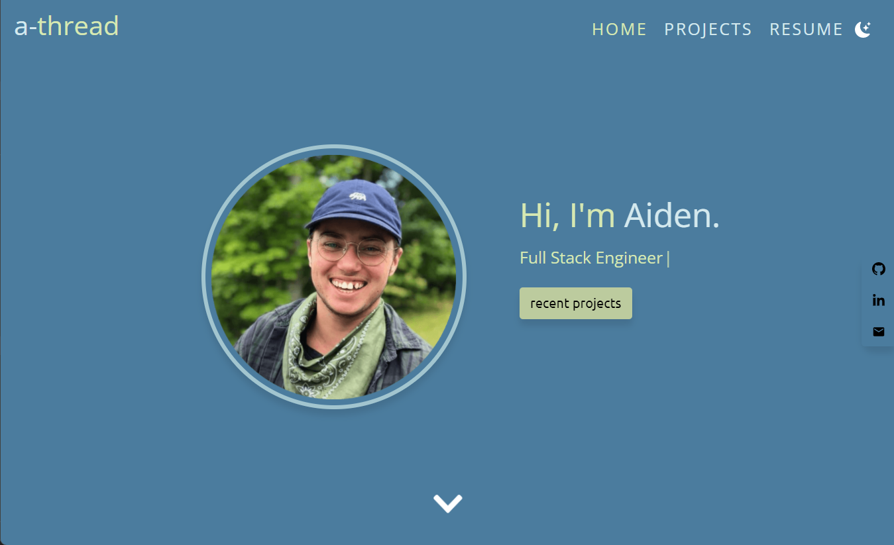

# Portfolio 

## Description

My portfolio website built with TypeScript and React. It contains a short bio, resume, an abreviated list of skills as well as information on recent projects. Theres also a fun dark mode option!
### Check it Out:  [a-thread.codes](https://a-thread.codes)

### Images of Home Screen

### Tools/Technologies Used

* React
* TypeScript
* Bootstrap
* Github Pages
* [react-typical](https://www.producthunt.com/posts/react-typical)

#### Questions

If you have any questions, feel free to [email me.](mailto:aiden.threadgoode@gmail.com)

If you'd like to see more of my work, feel free to check out [my github!](https://github.com/a-thread)

*© 2020 Aiden Threadgoode*

    
