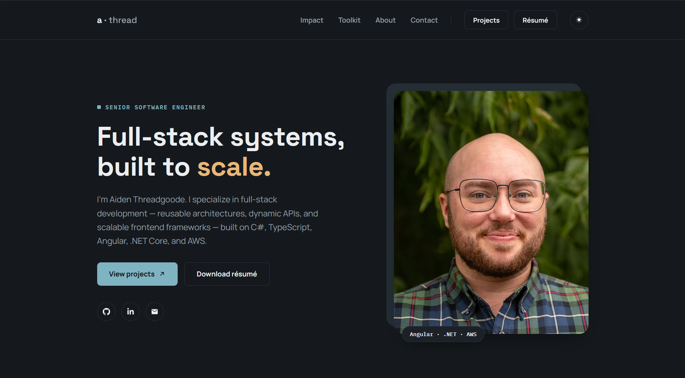
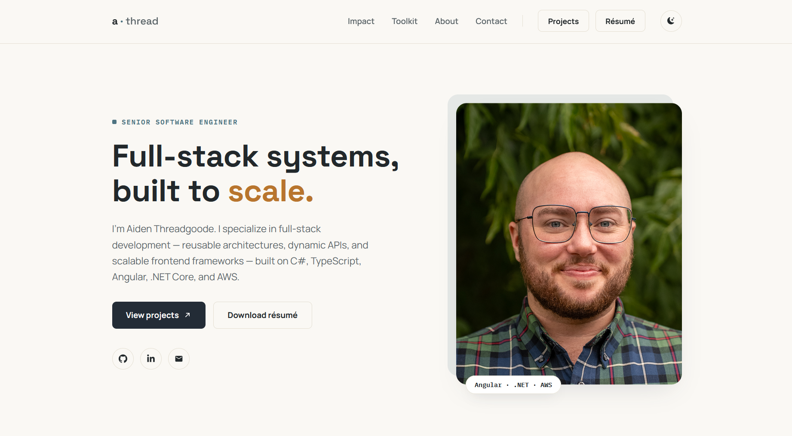

# Portfolio

## Description

My portfolio website, built with React, TypeScript, and Vite. It's a single-page site with a hero intro, career highlights, a skills toolkit, an about/bio section, testimonials, and contact info, plus dedicated pages for a project archive and an embedded résumé. There's also a fun dark mode option!

### Check it Out: [a-thread.codes](https://a-thread.codes)

### Images of Home Screen

|                          Dark Mode                           |                         Light Mode                         |
| :----------------------------------------------------------: | :--------------------------------------------------------: |
|  |  |

### Tools/Technologies Used

- React + TypeScript
- Vite
- Sass/SCSS
- React Router
- Github Pages (deployed via GitHub Actions on push to `main`)

#### Questions

If you have any questions, feel free to [email me.](mailto:a.threadless@proton.me)

If you'd like to see more of my work, feel free to check out [my github!](https://github.com/a-thread)

_© 2020 Aiden Threadgoode_
