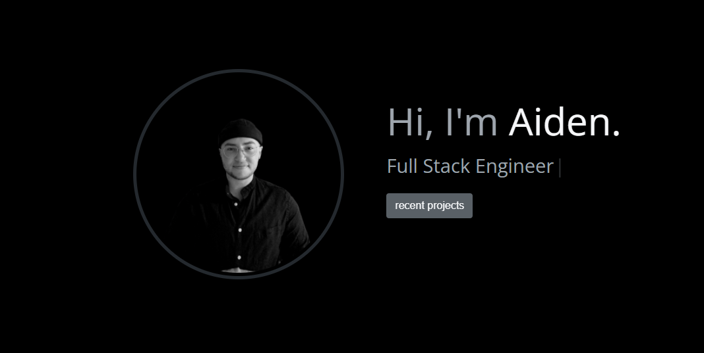

# Portfolio 

### Link to Portfolio: [a-thread.codes](https://a-thread.codes)

## Description

This is a simple and fun portfolio built with TypeScript and React. It contains a short bio, an abreviated list of skills as well as information on recent projects. A resume has also been included for the viewer's convenience!

### Tools/Technologies Used

* React
* TypeScript
* Bootstrap
* Github Pages
* [react-typical](https://www.producthunt.com/posts/react-typical)
* [imgbb](https://imgbb.com/)

#### Questions

If you have any questions, feel free to [email me.](mailto:aiden.threadgoode@gmail.com)

If you'd like to see more of my work, feel free to check out [my github!](https://github.com/a-thread)

*© 2020 Aiden Threadgoode*

    
